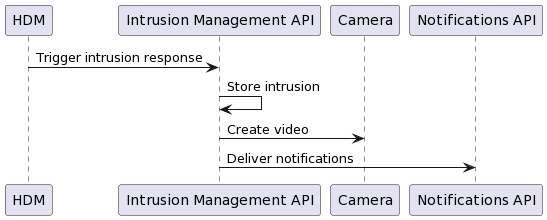

# IMA

Intrustion Management API.

The system responsible to dispatch the intrusion response.

# Introduction

This system is notified when the [HDM](#) detects an intrusion.

Upon detection, the IMA must ask the [Notifications API](#) to send the adequate notifications and asks the [Cameras](#) to make a video of the intrusion.

# Implementations

## V1

In this phase, this module is implemented as a lambda function, and all frames are stored in an S3 bucket.

The IMA is triggered by the [HDM](#), then notifies [Notifications API](#) and takes the adequate frames from S3, storing the generated video there as well.

This implementation was not scalable, so, it was decommissioned.

## V2

In the final version, the sesrvice is implemented in an ECS image, configured for scalability.
This solves the innitial problems with [V1](#v1).

In this iteration, the [HDM](#) triggers the Intrustion Management API, which will request the [Notifications API](#) module to send the adequate notifications and request video from the [Cameras](#).

# Diagrams

The HDM sends a request of the `IntrusionDetected` class, providing the camera Id, intrusion timestamp and the timestamp in which the alert was triggered.

Then, the intrusion is stored as an `Intrusion` object with a unique Id, so it can be differenciated from the others.

The requests sent are from the classes `NotificationRequest` and `VideoRequest`. 
The `NotificationRequest` informs the [Notifications API](#) of the camera ID and timestamp, so it can infer who to notify, taking into account their preferences.
The `VideoRequest` informs the correct camera of the start and end times and identifier of the intrusion, which will be used as the video file name.

The flow of actions can be seen in the following flow chart.

