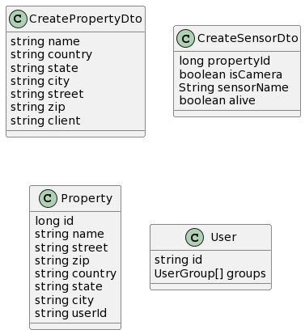

# Management API

This service handles properties, cameras and user preferences.

It also establishes another layer of verification through AWS Cognito to establish in depth security.

Users are only able to see their properties and cameras and change their user preferecnes.

Security officers have administrator previledges in the properties they operate.

Administrators have administrator previledges in every property, as well as the permission to create and delete properties, cameras and users.

# Implementation

It exposes authenticated CRUD endpoints for camerasproperties, cameras and users.

Camreas are defined by the property they are in and a name. 

There are some legacy properties that were not removed to save refractoring time. `isCamera` indicates whether the sensor is a camera or not, since a presence sensor was planned in the beggining of the project due to requirement misunderstanding. `alive` was a first attempt at implementing device health checks, which was later replaced by AWS CloudMap. 

Properties are defined by a numeric identifier, a name, country, state, city, street, zip code, and the owner's Id.
The properties' country, state and city are validated via the [countriesnow API](https://countriesnow.space).

User preferences store a user identifier and a string containing their preferences.
For more details on the preferences please read the [Notifications API](#) documentation.

The documentation is automatically generated with swagger and served via the REST API.

# Diagrams

