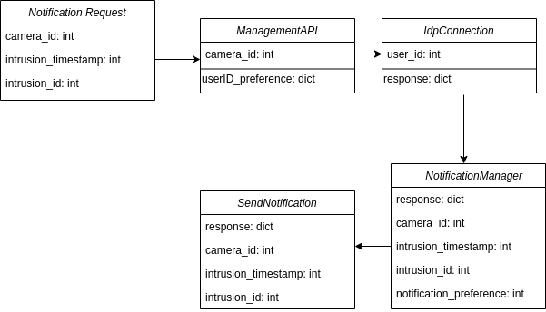

# Notification Module

This module is responsible for handling all notification requests. It's subscribed to notifications requests queue and whenever a message arrives at this given topic, the module will consume the message and proceed to send notifications to a certain list of users/officers through their preferencial method of receiving the notifications.

Notification logic is being controlled by the [Intrusion-Management-Api](https://github.com/Surveillance4SE/ima) service.

## V1
The initial phase of this module was implemented as lambda functions but due to conflits, it was decommissioned.

## V2
What we thought to be the final version, instead it turned out to be another step on the evolution of the module. 
In this version, an actual REST API using FastApi was built.

It was discontinued because it made more sense to make it using RabbitMQ messages.

## V3
In this final version, the service is implemented in an ECS image, configured for scalability.

Here, the [Intrusion-Management-Api](https://github.com/Surveillance4SE/ima) triggers the Notification Module once an intrusion is detected for it to send the adequate notifiactions for the right users.



Upon consuming the message from the broker, the Notification Module will start processing it by parsing the information.

```javascript
{
    camera_id: 1,
    intrusion_timestamp: 1671051238317,
    intrusion_id: 139
}
```

It will make use of [ManagementApi](https://github.com/Surveillance4SE/notification-module/blob/dev/src/management_api.py) to fetch the user/officer lists containing the people that should be notified and also their notification preference.  
With that, for each person in that list, it will make a call to AWS Cognito Identity Provider service on [IdpConnection](https://github.com/Surveillance4SE/notification-module/blob/dev/src/idp_connection.py) to get all the information necessary linked to that person.  
After that, it will call [NotificationManager](https://github.com/Surveillance4SE/notification-module/blob/dev/src/notification_manager.py) to assign the notification preference to the correct script call.  
The notifications itself are all processed using Twilio for Whatsapp, Sms and Call and for Email it's using AWS Simple Email Service.


## Dependencies
- `MySql Database` - Access is needed in order to send detailed information regarding the notification.
- [Management-Web-Api](https://github.com/Surveillance4SE/Management-Web-API) - controls notification details information.
- `Rabbit MQ server` - notification frames are exchanged using the RabbitMQ broker server.

